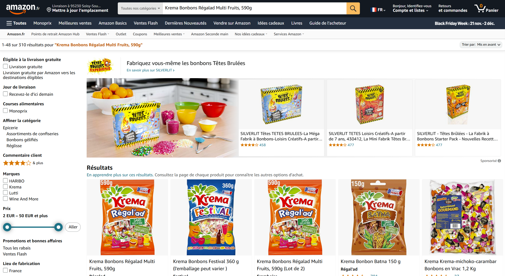

# 🛍️ Amazon Review Scraper with Selenium and SQLite 🐍


## 📜 Description

Ce projet utilise **Selenium** pour scraper les avis clients d'un produit sur Amazon et les stocker dans une base de données **SQLite**. Il permet d'extraire les informations suivantes :

- 📝 **Titre de l'avis**
- ⭐ **Note (étoiles)**
- 💬 **Commentaire**
- 👤 **Nom de l'utilisateur**

Le projet gère également la **pagination**, permettant de scraper **tous les avis** disponibles sur plusieurs pages.

## 🎥 **Démonstration**

Cliquez sur l'image ci-dessous pour visionner la vidéo de démonstration de mon projet :

<a href="https://akamidev.github.io/amazon_review_scraper/">
    
</a>

---


## 🛠️ Technologies Utilisées

- [Python 3.12](https://www.python.org/) 🐍
- [Selenium](https://www.selenium.dev/) 🤖
- [SQLite](https://www.sqlite.org/) 🗄️
- [ChromeDriver](https://sites.google.com/chromium.org/driver/) 🌐

## 📂 Structure du Projet

```plaintext
amazon_review_scraper/
├── chromedriver.exe             # ChromeDriver
├── main.py                      # Script principal
├── scraper.py                   # Script de scraping avec Selenium
├── database.py                  # Gestion de la base de données SQLite
├── requirements.txt             # Liste des dépendances Python
├── README.md                    # Documentation du projet
├── reviews.db                   # Base de données SQLite
└── reports/
    └── report.txt               # Rapport généré
```

### 🚀 Installation

## Prérequis

- Python 3.12 installé
- ChromeDriver compatible avec votre version de Chrome
- Google Chrome installé
  
## Installation des dépendances

```bash
pip install -r requirements.txt
```

### ⚙️ Configuration

Placez **chromedriver.exe** dans le dossier du projet et assurez-vous que le chemin est correct dans scraper.py :

```bash
service = Service("./chromedriver.exe")
```

### 🏃‍♂️ Lancer le projet

Exécutez le script principal :

```bash
python main.py
```

## 💾 Exemple de données dans SQLite

Voici un exemple des données extraites et stockées dans la base de données `reviews.db` :

| id | title                  | rating | comment                                       | user             |
|----|------------------------|--------|-----------------------------------------------|------------------|
| 1  | Très bon               | 5      | Bonbons de qualité, ne colle pas aux dents... | M. E             |
| 2  | 👍 Qualité et saveur 👍 | 5      | Quelle chouette et bonne gourmandise 👍        | Patricia         |
| 3  | Bonbons au fruit       | 5      | Reçu hier pratiquement plus dans le paquet... | Pas bien trop    |
| 4  | excellent              | 5      | excellent                                     | Sakill Wally     |
| 5  | Bonbons krema          | 4      | Très bons, je n'en trouvais plus en magasin...| Petite Fleur     |


### 📈 Fonctionnalités

- **✅ Scraping complet :** Extraction des avis sur plusieurs pages
- **📝 Stockage dans SQLite :** Sauvegarde des avis dans une base de données locale
- **🔍 Analyse des avis :** Calcul du nombre total d'avis et de la note moyenne
- **📊 Rapport généré :** Création d'un rapport texte avec toutes les informations

### 🐛 Problèmes connus

- Le scraping peut être bloqué par Amazon si trop de requêtes sont envoyées. Ajoutez des pauses (time.sleep()) pour éviter cela.
  
- Si chromedriver.exe n'est pas compatible, téléchargez une version appropriée.
  
### 🛠️ Améliorations futures

- Ajouter une analyse de sentiment pour classifier les avis en positifs et négatifs
- Créer une interface utilisateur avec [Streamlit](https://streamlit.io/)
- Exporter les avis vers un fichier CSV
 
### 🔧 Dépendances

Les dépendances Python sont listées dans requirements.txt :

```bash
selenium
sqlite3
```

Installez-les avec :

```bash
pip install -r requirements.txt
```

### 📜 Licence
Ce projet est sous licence MIT. Voir le fichier [LICENSE]() pour plus d’informations.

### 📬 Contact

Pour toute question, n'hésitez pas à me contacter :

- **💼 [LinkedIn](https://www.linkedin.com/in/akami-mehdi/)**
- **🐦 [Portfolio](https://akamimehdi.netlify.app/)**
- **📧 Email : akamimehdi.dev@gmail.com**

---

 **⭐ N'oubliez pas de laisser une étoile si ce projet vous a aidé ! ⭐**
